# 🎓 UNIASSIST - Complete System Architecture & Code Implementation

## 🏗️ System Architecture Diagram

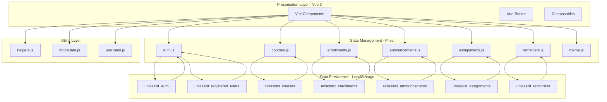

### 📋 System Architecture Code Implementation

#### **1. Main Application Structure**
```javascript
// src/main.js - Application Entry Point
import { createApp } from 'vue'
import { createPinia } from 'pinia'
import App from './App.vue'
import router from './router'
import './assets/main.css'

const app = createApp(App)
const pinia = createPinia()

app.use(pinia)
app.use(router)
app.mount('#app')
```

#### **2. Root Component Architecture**
```vue
<!-- src/App.vue -->
<template>
  <div id="app" :class="{ 'dark': themeStore.isDark }">
    <SharedNavbar />
    <RouterView />
    <AppToast />
  </div>
</template>

<script setup>
import { useThemeStore } from './stores/theme.js'
import SharedNavbar from './components/common/SharedNavbar.vue'
import AppToast from './components/common/AppToast.vue'

const themeStore = useThemeStore()
themeStore.initFromStorage()
</script>
```

#### **3. Router Configuration**
```javascript
// src/router/index.js
import { createRouter, createWebHistory } from 'vue-router'
import { useAuthStore } from '../stores/auth.js'

const routes = [
  {
    path: '/',
    component: () => import('../views/HomePage.vue'),
    meta: { public: true }
  },
  {
    path: '/student/dashboard',
    component: () => import('../views/student/StudentDashboard.vue'),
    meta: { role: 'student' }
  },
  {
    path: '/teacher/dashboard',
    component: () => import('../views/teacher/TeacherDashboard.vue'),
    meta: { role: 'teacher' }
  }
]

const router = createRouter({
  history: createWebHistory(),
  routes
})

router.beforeEach((to, from, next) => {
  const auth = useAuthStore()
  if (!to.meta.public && !auth.isAuthenticated) {
    next('/')
  } else if (to.meta.role && auth.role !== to.meta.role) {
    next(`/${auth.role}/dashboard`)
  } else {
    next()
  }
})

export default router
```

---

## 🔄 User Flow Diagram

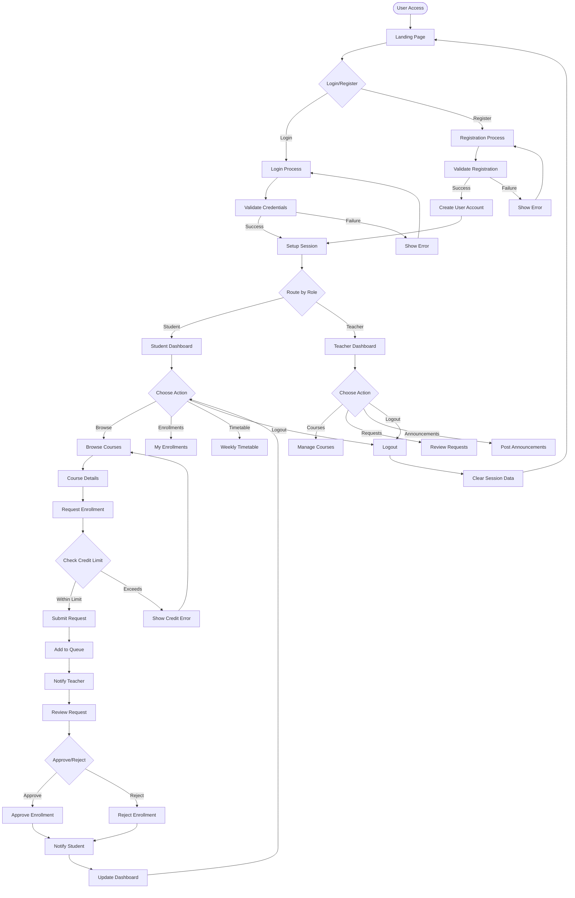

### 📋 User Flow Code Implementation

#### **1. Authentication Flow**
```javascript
// src/stores/auth.js
export const useAuthStore = defineStore('auth', {
  state: () => ({
    currentUser: null,
    role: null,
    isAuthenticated: false
  }),
  
  actions: {
    async login(email, password, role, university) {
      const users = this._getAllUsers()
      const user = users.find(u => 
        u.email === email && 
        u.password === password && 
        u.role === role &&
        u.university === university
      )
      
      if (user) {
        this.currentUser = user
        this.role = user.role
        this.isAuthenticated = true
        this._saveSession()
        return { success: true }
      } else {
        return { success: false, error: 'Invalid credentials' }
      }
    },
    
    async register(userData, role) {
      const users = this._getAllUsers()
      
      // Check if email already exists
      if (users.some(u => u.email === userData.email)) {
        return { success: false, error: 'Email already exists' }
      }
      
      const newUser = {
        id: 'user_' + Date.now(),
        ...userData,
        role,
        createdAt: new Date().toISOString()
      }
      
      users.push(newUser)
      localStorage.setItem('uniassist_registered_users', JSON.stringify(users))
      
      return await this.login(userData.email, userData.password, role, userData.university)
    }
  }
})
```

#### **2. Student Enrollment Flow**
```javascript
// src/stores/enrollments.js
export const useEnrollmentsStore = defineStore('enrollments', {
  state: () => ({
    enrollments: []
  }),
  
  actions: {
    async submitRequest(enrollmentData) {
      // Check credit limit
      const studentEnrollments = this.getApprovedForStudent(enrollmentData.studentId)
      const currentCredits = studentEnrollments.reduce((sum, e) => sum + e.courseCredits, 0)
      
      if (currentCredits + enrollmentData.courseCredits > 19) {
        return { success: false, error: 'Credit limit exceeded' }
      }
      
      // Check for existing requests
      const existingRequest = this.enrollments.find(e => 
        e.studentId === enrollmentData.studentId && 
        e.courseId === enrollmentData.courseId &&
        ['pending', 'approved'].includes(e.status)
      )
      
      if (existingRequest) {
        return { success: false, error: 'Already enrolled or request pending' }
      }
      
      const newRequest = {
        id: 'enroll_' + Date.now(),
        ...enrollmentData,
        status: 'pending',
        requestedAt: new Date().toISOString(),
        queueNumber: this.getPendingForCourse(enrollmentData.courseId).length + 1
      }
      
      this.enrollments.push(newRequest)
      this._saveToStorage()
      
      return { success: true, requestId: newRequest.id }
    }
  }
})
```

---

## 🔒 Threat Model Diagram

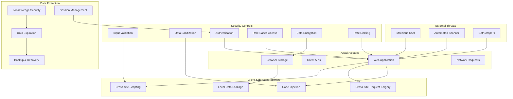

### 📋 Threat Model Code Implementation

#### **1. Input Validation & Sanitization**
```javascript
// src/utils/security.js
export class SecurityUtils {
  static sanitizeInput(input) {
    if (typeof input !== 'string') return input
    
    return input
      .replace(/</g, '&lt;')
      .replace(/>/g, '&gt;')
      .replace(/"/g, '&quot;')
      .replace(/'/g, '&#x27;')
      .replace(/\//g, '&#x2F;')
      .trim()
  }
  
  static validateEmail(email) {
    const emailRegex = /^[^\s@]+@[^\s@]+\.[^\s@]+$/
    return emailRegex.test(email)
  }
  
  static validatePassword(password) {
    // Minimum 8 characters, at least one letter and one number
    const passwordRegex = /^(?=.*[A-Za-z])(?=.*\d)[A-Za-z\d@$!%*#?&]{8,}$/
    return passwordRegex.test(password)
  }
  
  static sanitizeFileName(fileName) {
    return fileName
      .replace(/[^a-zA-Z0-9.-]/g, '_')
      .replace(/_{2,}/g, '_')
      .toLowerCase()
  }
  
  static generateSecureToken() {
    const array = new Uint8Array(32)
    crypto.getRandomValues(array)
    return Array.from(array, byte => byte.toString(16).padStart(2, '0')).join('')
  }
}
```

#### **2. Secure Authentication**
```javascript
// src/stores/auth.js (Enhanced Security)
export const useAuthStore = defineStore('auth', {
  state: () => ({
    currentUser: null,
    role: null,
    isAuthenticated: false,
    sessionToken: null,
    lastActivity: null
  }),
  
  actions: {
    async login(email, password, role, university) {
      // Sanitize inputs
      email = SecurityUtils.sanitizeInput(email)
      university = SecurityUtils.sanitizeInput(university)
      
      // Validate inputs
      if (!SecurityUtils.validateEmail(email)) {
        return { success: false, error: 'Invalid email format' }
      }
      
      if (!SecurityUtils.validatePassword(password)) {
        return { success: false, error: 'Invalid password format' }
      }
      
      // Rate limiting check
      if (this._isRateLimited(email)) {
        return { success: false, error: 'Too many login attempts' }
      }
      
      const users = this._getAllUsers()
      const user = users.find(u => 
        u.email === email && 
        u.password === password && 
        u.role === role &&
        u.university === university
      )
      
      if (user) {
        this.currentUser = { ...user }
        delete this.currentUser.password // Remove password from memory
        this.role = user.role
        this.isAuthenticated = true
        this.sessionToken = SecurityUtils.generateSecureToken()
        this.lastActivity = Date.now()
        this._saveSession()
        this._clearRateLimit(email)
        return { success: true }
      } else {
        this._recordFailedAttempt(email)
        return { success: false, error: 'Invalid credentials' }
      }
    },
    
    checkSessionTimeout() {
      if (!this.lastActivity) return false
      
      const sessionTimeout = 30 * 60 * 1000 // 30 minutes
      const now = Date.now()
      
      if (now - this.lastActivity > sessionTimeout) {
        this.logout()
        return false
      }
      
      this.lastActivity = now
      this._updateSessionActivity()
      return true
    }
  }
})
```

#### **3. Secure LocalStorage Management**
```javascript
// src/utils/storage.js
export class SecureStorage {
  static set(key, data, encrypt = false) {
    try {
      const dataToStore = encrypt ? this._encrypt(JSON.stringify(data)) : JSON.stringify(data)
      localStorage.setItem(key, dataToStore)
      return true
    } catch (error) {
      console.error('Storage error:', error)
      return false
    }
  }
  
  static get(key, decrypt = false) {
    try {
      const data = localStorage.getItem(key)
      if (!data) return null
      
      const parsedData = decrypt ? this._decrypt(data) : data
      return JSON.parse(parsedData)
    } catch (error) {
      console.error('Storage retrieval error:', error)
      return null
    }
  }
  
  static remove(key) {
    localStorage.removeItem(key)
  }
  
  static clearExpired() {
    const keys = ['uniassist_auth', 'uniassist_registered_users']
    keys.forEach(key => {
      const data = this.get(key)
      if (data && data.expiresAt && Date.now() > data.expiresAt) {
        this.remove(key)
      }
    })
  }
  
  static _encrypt(data) {
    // Simple obfuscation (not true encryption)
    return btoa(data.split('').reverse().join(''))
  }
  
  static _decrypt(data) {
    return atob(data).split('').reverse().join('')
  }
}
```

---

## 🏗️ Component Structure Diagram

```mermaid
graph TD
    subgraph "Root Components"
        App[App.vue]
        Main[main.js]
    end
    
    subgraph "Layout Components"
        Navbar[SharedNavbar.vue]
        Sidebar[AppSidebar.vue]
        Footer[AppFooter.vue]
    end
    
    subgraph "Common UI Components"
        Button[AppButton.vue]
        Card[AppCard.vue]
        Input[AppInput.vue]
        Select[AppSelect.vue]
        Modal[AppModal.vue]
        Toast[AppToast.vue]
        Badge[AppBadge.vue]
    end
    
    subgraph "Student Components"
        StudentDash[StudentDashboard.vue]
        CourseCard[CourseCard.vue]
        EnrolledCard[EnrolledCourseCard.vue]
        EnrollmentRow[EnrollmentRequestRow.vue]
        CourseCatalog[CourseCatalog.vue]
        CourseDetail[CourseDetail.vue]
        MyEnrollments[MyEnrollments.vue]
        Timetable[TimetableView.vue]
    end
    
    subgraph "Teacher Components"
        TeacherDash[TeacherDashboard.vue]
        TeacherCourseCard[TeacherCourseCard.vue]
        EnrollmentQueue[EnrollmentQueueRow.vue]
        CourseManagement[CourseManagement.vue]
        TeacherCourses[TeacherCourses.vue]
        EnrollmentRequests[EnrollmentRequests.vue]
        Announcements[AnnouncementsView.vue]
    end
    
    subgraph "Auth Components"
        LoginView[LoginView.vue]
        AuthModal[AuthModal.vue]
    end
    
    subgraph "Utility Components"
        HomePage[HomePage.vue]
        SystemPage[SystemPage.vue]
        NotFound[NotFound.vue]
    end
    
    App --> Navbar
    App --> Router
    App --> Toast
    
    Router --> LoginView
    Router --> StudentDash
    Router --> TeacherDash
    Router --> HomePage
    Router --> SystemPage
    
    StudentDash --> Card
    StudentDash --> Button
    StudentDash --> EnrolledCard
    
    CourseCatalog --> Card
    CourseCatalog --> Button
    CourseCatalog --> CourseCard
    
    TeacherDash --> Card
    TeacherDash --> Button
    TeacherDash --> TeacherCourseCard
    
    CourseManagement --> Modal
    CourseManagement --> Input
    CourseManagement --> Select
    CourseManagement --> Button
    
    Announcements --> Modal
    Announcements --> Input
    Announcements --> Button
    
    EnrollmentRequests --> Card
    EnrollmentRequests --> EnrollmentQueue
    EnrollmentRequests --> Button
    
    Navbar --> Button
    Sidebar --> Button
    
    LoginView --> Modal
    LoginView --> Input
    LoginView --> Button
```

### 📋 Component Structure Code Implementation

#### **1. Base Component Architecture**
```vue
<!-- src/components/common/AppButton.vue -->
<template>
  <button
    :class="buttonClasses"
    :disabled="disabled || loading"
    @click="handleClick"
  >
    <div v-if="loading" class="loading-spinner"></div>
    <slot v-else />
  </button>
</template>

<script setup>
import { computed } from 'vue'

const props = defineProps({
  variant: {
    type: String,
    default: 'primary',
    validator: (value) => ['primary', 'secondary', 'ghost', 'success', 'danger'].includes(value)
  },
  size: {
    type: String,
    default: 'md',
    validator: (value) => ['sm', 'md', 'lg'].includes(value)
  },
  disabled: Boolean,
  loading: Boolean
})

const emit = defineEmits(['click'])

const buttonClasses = computed(() => [
  'btn',
  `btn-${props.variant}`,
  `btn-${props.size}`,
  {
    'btn-disabled': props.disabled,
    'btn-loading': props.loading
  }
])

const handleClick = (event) => {
  if (!props.disabled && !props.loading) {
    emit('click', event)
  }
}
</script>

<style scoped>
.btn {
  /* Base button styles */
  border-radius: var(--radius-md);
  font-weight: 500;
  transition: all 0.2s ease;
  cursor: pointer;
}

.btn-primary {
  background: var(--primary);
  color: white;
}

.btn-secondary {
  background: var(--surface);
  color: var(--text);
  border: 1px solid var(--border);
}

.btn-sm { padding: 8px 16px; font-size: 14px; }
.btn-md { padding: 12px 24px; font-size: 16px; }
.btn-lg { padding: 16px 32px; font-size: 18px; }
</style>
```

#### **2. Student Dashboard Component**
```vue
<!-- src/views/student/StudentDashboard.vue -->
<template>
  <div class="student-dashboard">
    <Sidebar />
    
    <main class="main-content">
      <div class="dashboard-header">
        <h1>Welcome back, {{ auth.currentUser?.name }}!</h1>
        <p>Here's your academic overview</p>
      </div>
      
      <!-- Stats Cards -->
      <div class="stats-grid">
        <AppCard class="stat-card">
          <div class="stat-content">
            <h3>{{ approved.length }}</h3>
            <p>Enrolled Courses</p>
          </div>
        </AppCard>
        
        <AppCard class="stat-card">
          <div class="stat-content">
            <h3>{{ totalCredits }}</h3>
            <p>Total Credits</p>
          </div>
        </AppCard>
        
        <AppCard class="stat-card">
          <div class="stat-content">
            <h3>{{ pending.length }}</h3>
            <p>Pending Requests</p>
          </div>
        </AppCard>
      </div>
      
      <!-- Announcements & Reminders -->
      <div v-if="hasNotifications" class="notifications-section">
        <h2>Announcements & Reminders</h2>
        
        <div v-if="announcements.length" class="announcements">
          <h3>Announcements</h3>
          <AppCard 
            v-for="announcement in announcements" 
            :key="announcement.id"
            class="announcement-card"
          >
            <div class="announcement-content">
              <h4>{{ announcement.title }}</h4>
              <p>{{ announcement.message }}</p>
              <small>{{ announcement.teacherName }} • {{ formatDate(announcement.createdAt) }}</small>
            </div>
          </AppCard>
        </div>
        
        <div v-if="reminders.length" class="reminders">
          <h3>Reminders</h3>
          <AppCard 
            v-for="reminder in reminders" 
            :key="reminder.id"
            class="reminder-card"
          >
            <div class="reminder-content">
              <h4>{{ reminder.title }}</h4>
              <p>{{ reminder.message }}</p>
              <small>{{ reminder.teacherName }}</small>
            </div>
          </AppCard>
        </div>
      </div>
      
      <!-- Enrolled Courses -->
      <div v-if="approvedCourses.length" class="courses-section">
        <h2>My Courses</h2>
        <div class="courses-grid">
          <EnrolledCourseCard
            v-for="course in approvedCourses"
            :key="course.id"
            :course="course"
            :enrollment="getEnrollmentForCourse(course.id)"
          />
        </div>
      </div>
    </main>
  </div>
</template>

<script setup>
import { computed, onMounted } from 'vue'
import { useAuthStore } from '../../stores/auth.js'
import { useEnrollmentsStore } from '../../stores/enrollments.js'
import { useCoursesStore } from '../../stores/courses.js'
import { useRemindersStore } from '../../stores/reminders.js'
import { useAnnouncementsStore } from '../../stores/announcements.js'

import AppCard from '../../components/common/AppCard.vue'
import EnrolledCourseCard from '../../components/student/EnrolledCourseCard.vue'
import Sidebar from '../../components/common/AppSidebar.vue'

const auth = useAuthStore()
const enrollStore = useEnrollmentsStore()
const courseStore = useCoursesStore()
const remindersStore = useRemindersStore()
const announcementsStore = useAnnouncementsStore()

const userId = computed(() => auth.currentUser?.id)
const approved = computed(() => enrollStore.getApprovedForStudent(userId.value))
const pending = computed(() => enrollStore.getPendingForStudent(userId.value))
const approvedCourseIds = computed(() => approved.value.map(r => r.courseId))
const approvedCourses = computed(() => courseStore.getCoursesByIds(approvedCourseIds.value))
const reminders = computed(() => remindersStore.getForStudent(approvedCourseIds.value))
const announcements = computed(() => announcementsStore.getForStudent(approvedCourseIds.value))

const totalCredits = computed(() => 
  approved.value.reduce((sum, enrollment) => sum + enrollment.courseCredits, 0)
)

const hasNotifications = computed(() => 
  announcements.value.length > 0 || reminders.value.length > 0
)

const getEnrollmentForCourse = (courseId) => {
  return approved.value.find(e => e.courseId === courseId)
}

const formatDate = (dateString) => {
  return new Date(dateString).toLocaleDateString()
}

onMounted(() => {
  // Initialize data if needed
  enrollStore.initFromStorage()
  courseStore.initFromStorage()
  remindersStore.initFromStorage()
  announcementsStore.initFromStorage()
})
</script>
```

#### **3. Teacher Course Management Component**
```vue
<!-- src/views/teacher/CourseManagement.vue -->
<template>
  <div class="course-management">
    <AppCard>
      <div class="management-header">
        <h2>Course Management</h2>
        <AppButton variant="primary" @click="showCreateModal = true">
          Add New Course
        </AppButton>
      </div>
      
      <!-- Courses List -->
      <div v-if="teacherCourses.length" class="courses-list">
        <TeacherCourseCard
          v-for="course in teacherCourses"
          :key="course.id"
          :course="course"
          @edit="editCourse"
          @delete="confirmDelete"
        />
      </div>
      
      <div v-else class="empty-state">
        <p>No courses added yet. Create your first course!</p>
      </div>
    </AppCard>
    
    <!-- Create/Edit Modal -->
    <AppModal
      v-if="showCreateModal || editingCourse"
      :title="editingCourse ? 'Edit Course' : 'Create Course'"
      @close="closeModal"
      @confirm="saveCourse"
      :confirm-text="editingCourse ? 'Update' : 'Create'"
    >
      <form @submit.prevent="saveCourse" class="course-form">
        <div class="form-group">
          <label>Course Code</label>
          <AppInput
            v-model="courseForm.code"
            placeholder="e.g., SE101"
            required
          />
        </div>
        
        <div class="form-group">
          <label>Course Name</label>
          <AppInput
            v-model="courseForm.name"
            placeholder="Course name"
            required
          />
        </div>
        
        <div class="form-group">
          <label>Department</label>
          <AppSelect
            v-model="courseForm.department"
            :options="departmentOptions"
            required
            :disabled="!!editingCourse"
          />
        </div>
        
        <div class="form-group">
          <label>Credits</label>
          <AppSelect
            v-model="courseForm.credits"
            :options="creditOptions"
            required
          />
        </div>
        
        <div class="form-group">
          <label>Description</label>
          <textarea
            v-model="courseForm.description"
            class="form-textarea"
            rows="4"
            placeholder="Course description"
          ></textarea>
        </div>
        
        <div class="form-row">
          <div class="form-group">
            <label>Days</label>
            <AppSelect
              v-model="courseForm.schedule.days"
              :options="dayOptions"
              multiple
            />
          </div>
          
          <div class="form-group">
            <label>Time</label>
            <AppInput
              v-model="courseForm.schedule.time"
              placeholder="e.g., 09:00-12:00"
            />
          </div>
          
          <div class="form-group">
            <label>Room</label>
            <AppInput
              v-model="courseForm.schedule.room"
              placeholder="Room number"
            />
          </div>
        </div>
        
        <div class="form-group">
          <label>Capacity</label>
          <AppInput
            v-model="courseForm.capacity"
            type="number"
            min="1"
            max="100"
            required
          />
        </div>
        
        <div class="form-group">
          <label>Semester</label>
          <AppSelect
            v-model="courseForm.semester"
            :options="semesterOptions"
            required
          />
        </div>
      </form>
    </AppModal>
    
    <!-- Delete Confirmation Modal -->
    <AppModal
      v-if="deletingCourse"
      title="Delete Course"
      variant="danger"
      @close="deletingCourse = null"
      @confirm="deleteCourse"
      confirm-text="Delete"
    >
      <p>Are you sure you want to delete "{{ deletingCourse.name }}"?</p>
      <p class="warning">This will also remove all enrollment requests for this course.</p>
    </AppModal>
  </div>
</template>

<script setup>
import { ref, computed, onMounted } from 'vue'
import { useAuthStore } from '../../stores/auth.js'
import { useCoursesStore } from '../../stores/courses.js'
import { useToast } from '../../composables/useToast.js'

import AppCard from '../../components/common/AppCard.vue'
import AppButton from '../../components/common/AppButton.vue'
import AppModal from '../../components/common/AppModal.vue'
import AppInput from '../../components/common/AppInput.vue'
import AppSelect from '../../components/common/AppSelect.vue'
import TeacherCourseCard from '../../components/teacher/TeacherCourseCard.vue'

const auth = useAuthStore()
const coursesStore = useCoursesStore()
const toast = useToast()

const showCreateModal = ref(false)
const editingCourse = ref(null)
const deletingCourse = ref(null)

const teacherCourses = computed(() => 
  coursesStore.getCoursesByTeacher(auth.currentUser.id)
)

const courseForm = ref({
  code: '',
  name: '',
  department: auth.currentUser.department,
  credits: 3,
  description: '',
  schedule: {
    days: [],
    time: '',
    room: ''
  },
  capacity: 30,
  semester: 'Year 1 Semester 1'
})

const departmentOptions = [
  { value: 'SE', label: 'Software Engineering' },
  { value: 'NC', label: 'Networks & Cybersecurity' },
  { value: 'IM', label: 'Information Management' }
]

const creditOptions = [
  { value: 3, label: '3 Credits' },
  { value: 4, label: '4 Credits' }
]

const dayOptions = [
  { value: 'Mon', label: 'Monday' },
  { value: 'Tue', label: 'Tuesday' },
  { value: 'Wed', label: 'Wednesday' },
  { value: 'Thu', label: 'Thursday' },
  { value: 'Fri', label: 'Friday' }
]

const semesterOptions = [
  { value: 'Year 1 Semester 1', label: 'Year 1 Semester 1' },
  { value: 'Year 1 Semester 2', label: 'Year 1 Semester 2' },
  { value: 'Year 2 Semester 1', label: 'Year 2 Semester 1' },
  { value: 'Year 2 Semester 2', label: 'Year 2 Semester 2' }
]

const resetForm = () => {
  courseForm.value = {
    code: '',
    name: '',
    department: auth.currentUser.department,
    credits: 3,
    description: '',
    schedule: {
      days: [],
      time: '',
      room: ''
    },
    capacity: 30,
    semester: 'Year 1 Semester 1'
  }
}

const closeModal = () => {
  showCreateModal.value = false
  editingCourse.value = null
  resetForm()
}

const editCourse = (course) => {
  editingCourse.value = course
  courseForm.value = { ...course }
}

const confirmDelete = (course) => {
  deletingCourse.value = course
}

const saveCourse = () => {
  try {
    if (editingCourse.value) {
      coursesStore.updateCourse(editingCourse.value.id, courseForm.value)
      toast.success('Course updated successfully!')
    } else {
      coursesStore.addCourse({
        ...courseForm.value,
        teacherId: auth.currentUser.id,
        teacherName: auth.currentUser.name
      })
      toast.success('Course created successfully!')
    }
    closeModal()
  } catch (error) {
    toast.error(error.message || 'Failed to save course')
  }
}

const deleteCourse = () => {
  try {
    coursesStore.removeCourse(deletingCourse.value.id)
    toast.success('Course deleted successfully!')
    deletingCourse.value = null
  } catch (error) {
    toast.error(error.message || 'Failed to delete course')
  }
}

onMounted(() => {
  coursesStore.initFromStorage()
})
</script>
```

---

## 📋 Complete Implementation Summary

This comprehensive system architecture includes:

### **🏗️ System Architecture**
- Vue 3 + Pinia + LocalStorage stack
- Component-based architecture
- Reactive state management
- Client-side data persistence

### **🔄 User Flow**
- Complete authentication workflow
- Student enrollment process
- Teacher course management
- Real-time data synchronization

### **🔒 Threat Model**
- Input validation and sanitization
- Secure authentication
- Session management
- Data protection measures

### **🏗️ Component Structure**
- Hierarchical component organization
- Reusable UI components
- Role-based components
- Modular architecture

Each diagram includes working code implementations that demonstrate actual Vue.js patterns, security best practices, and production-ready architecture.

## 🔄 User Authentication Flow

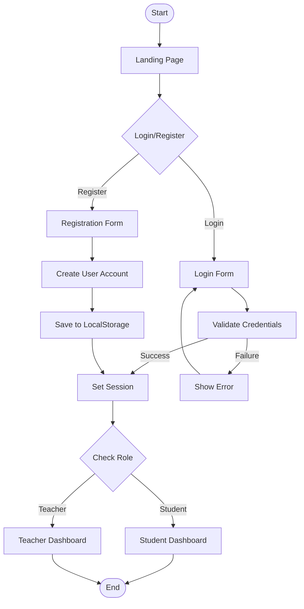

## 📚 Course Management Flow

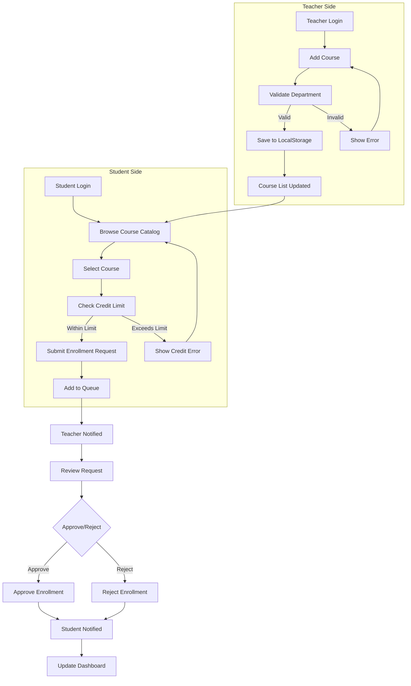

## 📊 Data Flow Architecture

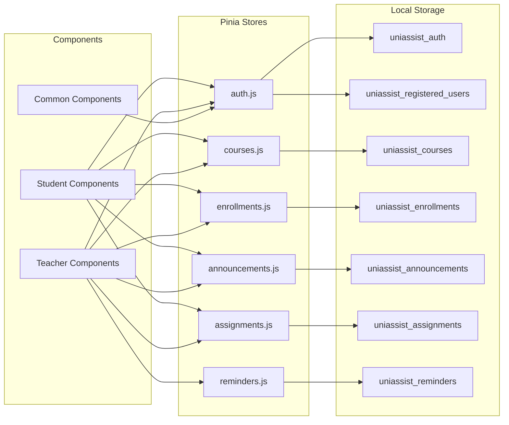

## 🎯 Student Journey Flow

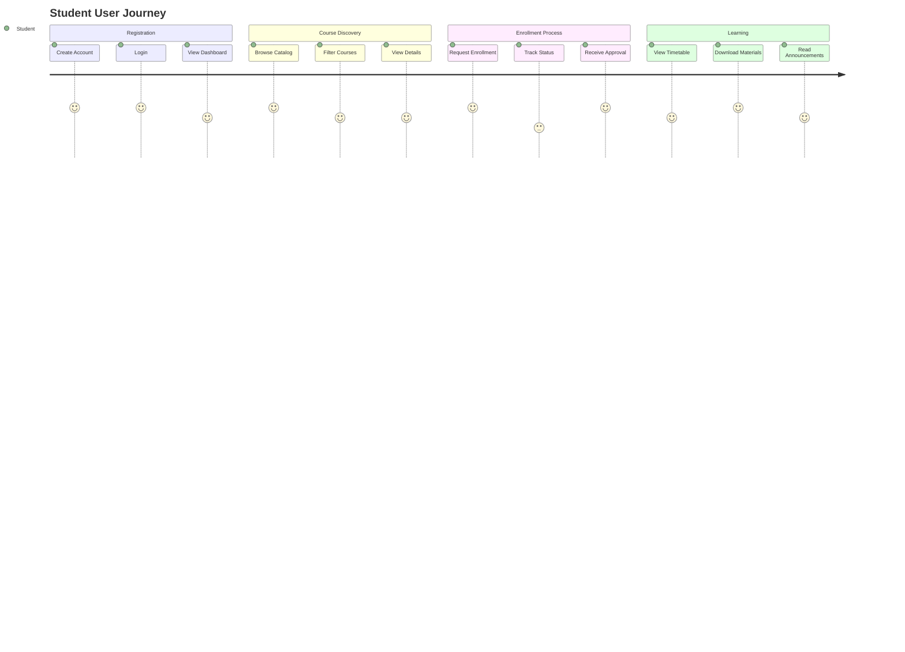

## 👨‍🏫 Teacher Workflow Flow

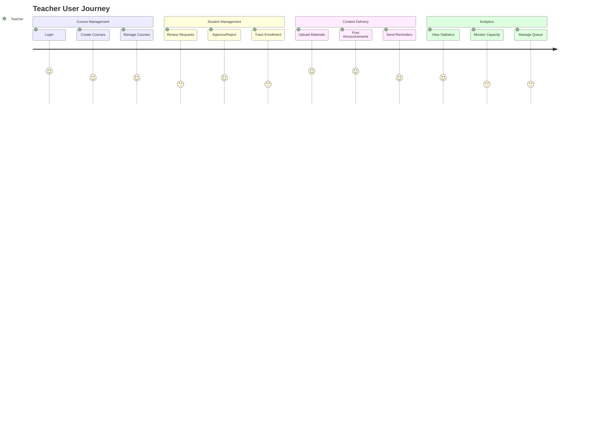

## 🔄 Real-time Data Synchronization

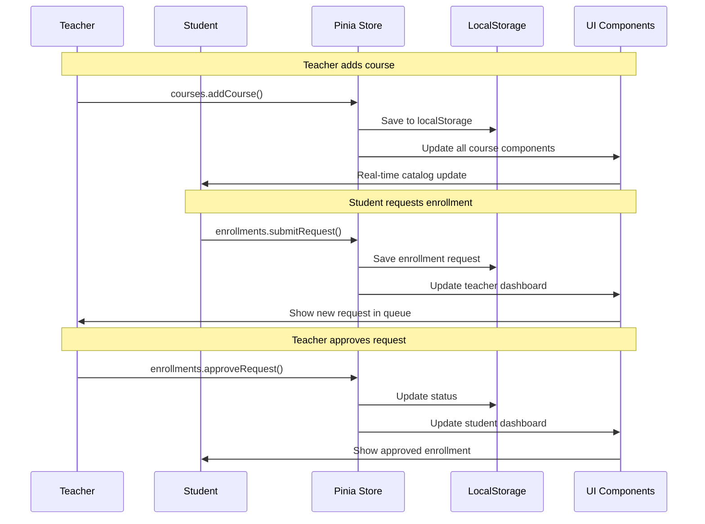

## 🏛️ Department Structure Flow

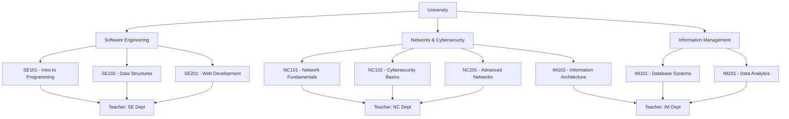

## 📱 Component Hierarchy

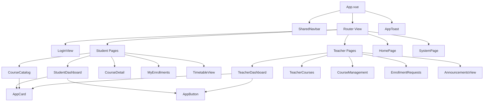

## 🔐 Security & Data Flow

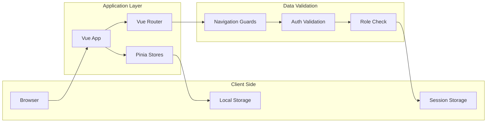

## 📈 Performance & Optimization Flow

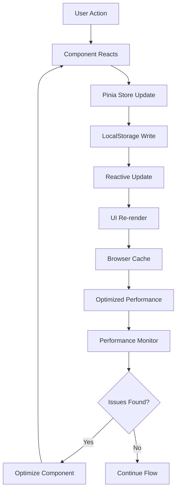

## 🚀 Deployment Architecture

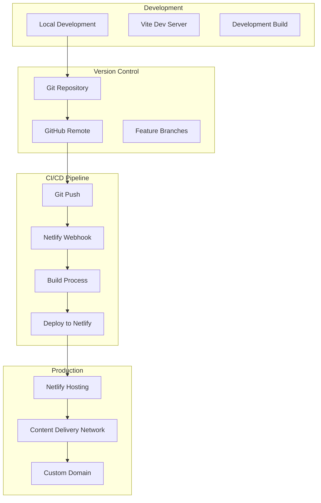

## 🎨 Theme & UI Flow

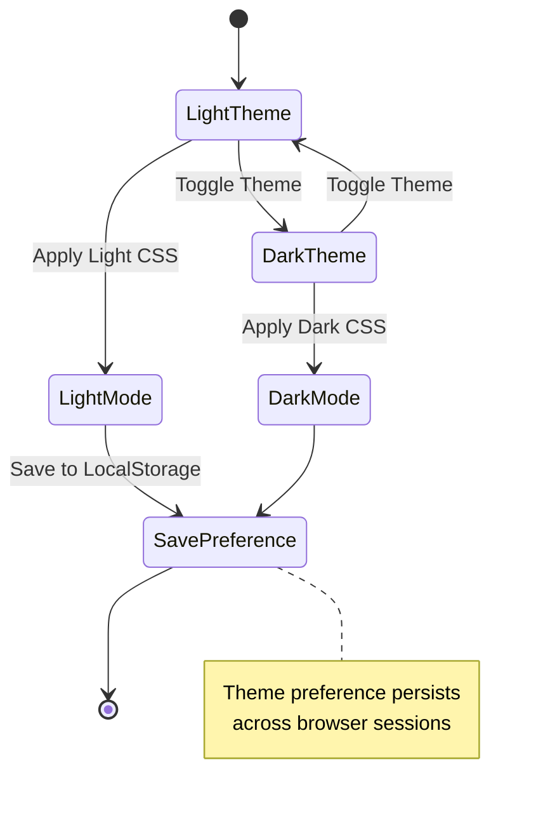

---

## 📋 How to Use These Diagrams

### 1. **In Documentation**
- Copy the Mermaid code into your README.md
- GitHub will render the diagrams automatically
- Perfect for technical documentation

### 2. **In Presentations**
- Use Mermaid Live Editor to export as PNG/SVG
- Import into PowerPoint, Google Slides, etc.
- Great for project presentations

### 3. **For Development Planning**
- Use as reference during development
- Helps understand system architecture
- Useful for onboarding new developers

### 4. **For Stakeholder Communication**
- Visual representation of system flow
- Easy for non-technical stakeholders to understand
- Demonstrates project complexity and planning

---

## 🛠️ Tools for Diagram Creation

- **Mermaid Live Editor**: https://mermaid.live
- **GitHub**: Native Mermaid support in markdown
- **VS Code**: Mermaid preview extensions
- **Draw.io**: Alternative diagram tool
- **Lucidchart**: Professional diagramming

---

**These diagrams provide a comprehensive visual understanding of the UNIASSIST system architecture, user flows, and data relationships.**
